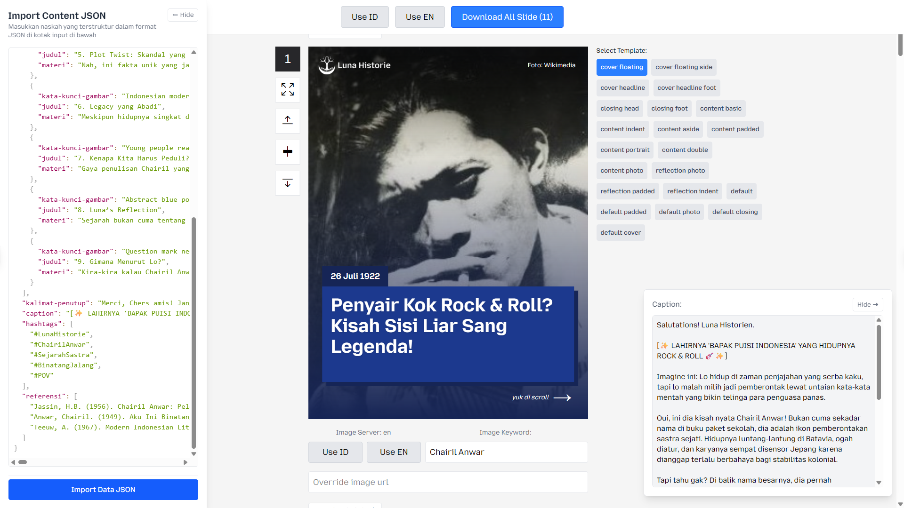
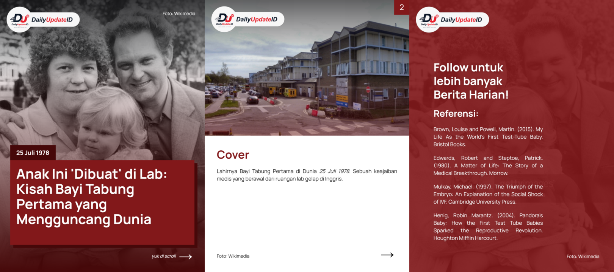

# 🌙 DailyUpdate Content Creation


Selamat datang di **DailyUpdate Content Creation** — sebuah tool eksklusif untuk merangkai artikel berita harian yang moderen. Dikembangkan khusus untuk **DailyUpdate Historie**, platform yang mengusung estetika merah dalam setiap lembar beritanya.





---

## 🌟 Fitur Unggulan
- 📜 **Import JSON Terstruktur:** Tuangkan naskah sejarah Anda ke dalam format data yang rapi.
- 🖼️ **Dynamic Slide Engine:** Visualisasi otomatis konten menjadi slide berestetika tinggi.
- 🏛️ **Template Library (Versailles Collection):** Koleksi tata letak slide yang dirancang khusus untuk narasi sejarah.
- 🖋️ **Export Caption:** Konversi narasi slide menjadi caption media sosial yang memikat.


## 🚀 Panduan Penggunaan

### 1. Memulai Narasi
Buka panel **"Import Content JSON"** di sisi kiri. Input naskah sejarah Anda dengan struktur berikut:

```json
{
  "tanggal": "",
  "kata-kunci-gambar": "",
  "judul-hook": "Misteri Bastille",
  "slides": [
    {
      "judul": "Awal Mula",
      "materi": "Sejarah dimulai dari...",
      "template_to_use": "content_basic"
    }
  ],
  "kalimat-penutup": "",
  "caption": "",
  "hashtags": [],
  "referensi": [],
}
```

### 2. Menambahkan Slide Baru
Untuk memperluas narasi, tambahkan objek slide baru ke dalam array `slides` di JSON Anda. Pastikan setiap slide memiliki `judul`, `materi`, dan `template_to_use` yang sesuai.


## 🛠️ Perluasan Template (Custom Atelier)

Untuk menambahkan desain template slide baru ke dalam *Atelier* DailyUpdate Historie:

1.  **Crafting:** Buat komponen React baru di `src/slides/template/` (contoh: `DailyUpdateRoyalCover.jsx`).
2.  **Define Layout:** Rancang struktur JSX Anda dengan estetika biru khas Prancis.
3.  **Registration:** Daftarkan template di `src/slides/Slide.jsx` ke dalam objek `templates`:
    ```jsx
    import DailyUpdateRoyalCover from "./template/DailyUpdateRoyalCover";

    const templates = {
      "royal_cover": <DailyUpdateRoyalCover ... />
    };
    ```
4.  **Implementation:** Pilih dan klik `"royal_cover"` untuk menggunakan template.
